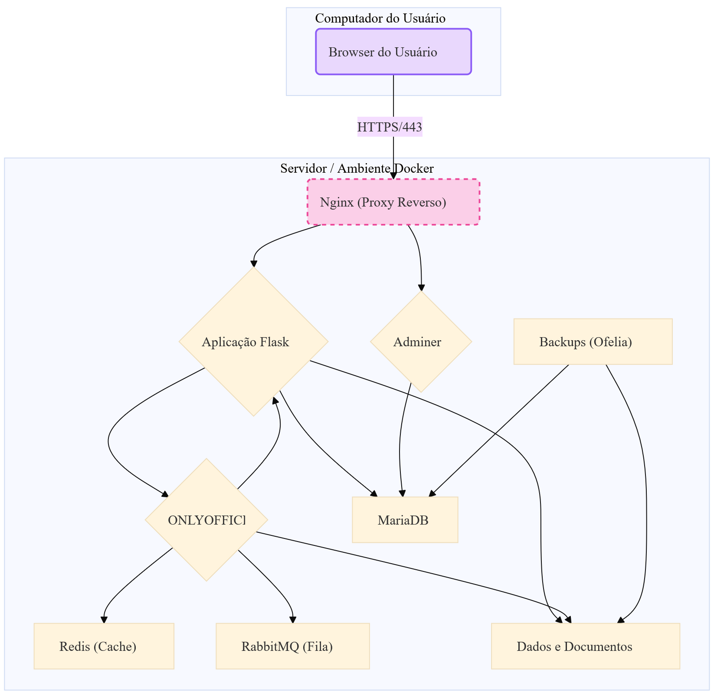

# 🏥 Clínica Evolution - Sistema de Gestão para Clínicas


**Solução completa para gerenciamento de clínicas** com agendamento inteligente, prontuário eletrônico integrado e comunicação em tempo real. Este é o repositório central para o desenvolvimento e manutenção do sistema.

  

## ✨ Funcionalidades Principais

*   **📅 Agenda Inteligente:** Visualização em calendário (mês/semana/dia) ou lista, cores por status, edição em tempo real e filtros avançados.
*   **👥 Gestão de Usuários Multiperfil:** 4 níveis de acesso (Admin, Recepcionista, Profissional, Paciente) com autenticação segura (CPF/E-mail) e proteção CAPTCHA.
*   **📄 Prontuário Eletrônico (PEP):** Editor de documentos **ONLYOFFICE** integrado para DOCX/XLSX, com controle de versões e organização por pastas.
*   **🔔 Comunicação em Tempo Real:** Notificações instantâneas via WebSockets (Socket.IO) sobre eventos importantes na plataforma.

---

## 🚀 Guia de Início Rápido (Ambiente de Desenvolvimento)

O ambiente é 100% containerizado com Docker, garantindo uma instalação rápida e consistente.

**1. Clone o Repositório:**
```bash
git clone https://github.com/seu-usuario/clinica-evolution.git
cd clinica-evolution
```

**2. Configure o Ambiente:**
Copie o arquivo de exemplo e ajuste as variáveis se necessário (as senhas padrão já estão configuradas para facilitar).
```bash
cp .env.example .env
# nano .env # Opcional: edite as chaves se desejar
```

**3. Inicie os Serviços:**
Este comando irá construir, baixar e iniciar todos os containers necessários.
```bash
docker-compose up -d --build
```

**4. Carregue os Dados de Demonstração (Opcional):**
Para popular o sistema com dados de teste, execute o comando abaixo para restaurar o backup padrão.
```bash
docker exec -i clinica_mariadb_db mariadb -u evolution -p'#!Ev0_Lm90=4M4' clinica_evolution < backup.sql
```

**5. Acesse as Interfaces:**
*   **Aplicação Principal:** 👉 **[http://localhost:5000](http://localhost:5000)**
*   **Interface Gráfica do Banco (Adminer):** 👉 **[http://localhost:8082](http://localhost:8082)**
*   **Servidor ONLYOFFICE:** 👉 [http://localhost:8081](http://localhost:8081)

---

## 🔑 Credenciais de Acesso (Dados de Teste)

| Perfil        | E-mail                  | Senha      |
|---------------|-------------------------|------------|
| Administrador | `admin@clinica.com`     | `senha123` |
| Recepcionista | `recepcao@clinica.com`  | `recep123` |
| Profissional  | `maria@clinica.com`     | `maria123` |
| Paciente      | `joao@exemplo.com`      | `joao123`  |

Para acessar o banco de dados via **Adminer** (em http://localhost:8082):
*   **Sistema:** `MariaDB`
*   **Servidor:** `db_mysql`
*   **Usuário:** `evolution`
*   **Senha:** `#!Ev0_Lm90=4M4`
*   **Banco de dados:** `clinica_evolution`

---

## 🔧 Manutenção e Operações

### Backup e Restauração do Banco de Dados

- **Criar um Backup:**
  ```bash
  # Gera um arquivo de backup com a data atual no nome
  docker exec clinica_mariadb_db mariadb-dump -u evolution -p'#!Ev0_Lm90=4M4' clinica_evolution > backup_$(date +%d-%m-%Y).sql
  ```
- **Restaurar um Backup:**
  ```bash
  docker exec -i clinica_mariadb_db mariadb -u evolution -p'#!Ev0_Lm90=4M4' clinica_evolution < nome_do_arquivo_backup.sql
  ```
> **⚠️ Importante:** É fundamental automatizar uma rotina de backups diários quando o sistema estiver em produção.

### Migrações de Banco de Dados (Flask-Migrate)
Quando a estrutura das tabelas (`models.py`) é alterada:

1.  **Gerar Script de Migração:**
    ```bash
    docker-compose exec flask_app flask db migrate -m "Descrição da alteração"
    ```
2.  **Aplicar Migração:**
    ```bash
    docker-compose exec flask_app flask db upgrade
    ```
> **Atenção:** Sempre faça um backup do banco de dados antes de aplicar uma migração em produção.

### Comandos Úteis do Docker
| Ação                       | Comando                                      |
|----------------------------|----------------------------------------------|
| **Parar todos os serviços**| `docker-compose down`                        |
| **Ver logs da aplicação**  | `docker-compose logs -f flask_app`           |
| **Reiniciar a aplicação**  | `docker-compose restart flask_app`           |
| **Atualizar e recriar**    | `docker-compose up -d --build`               |

---

## 🛠️ Arquitetura e Tecnologias

| Camada         | Tecnologias                                                                 |
|----------------|-----------------------------------------------------------------------------|
| **Backend**    | Python 3, Flask, SQLAlchemy, Flask-SocketIO, Flask-Login                    |
| **Frontend**   | Bootstrap 5, JavaScript, FullCalendar.js, SweetAlert2, Socket.IO Client     |
| **Banco**      | MariaDB                                                                     |
| **Infra**      | Docker, Docker Compose, Gunicorn                                            |
| **Integração** | ONLYOFFICE Docs, Redis, RabbitMQ, Adminer                                   |

### Diagrama da Arquitetura de Containers


> **Nota:** O Nginx é recomendado para o ambiente de produção como um proxy reverso para centralizar o acesso e gerenciar certificados SSL. No ambiente de desenvolvimento atual, o acesso é direto às portas expostas.

---
> **Clínica Evolution** - Modernizando a gestão de saúde através da tecnologia ✨  
> Desenvolvido com ❤️ por Antony Andrade